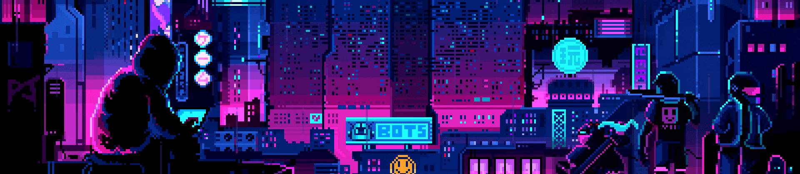
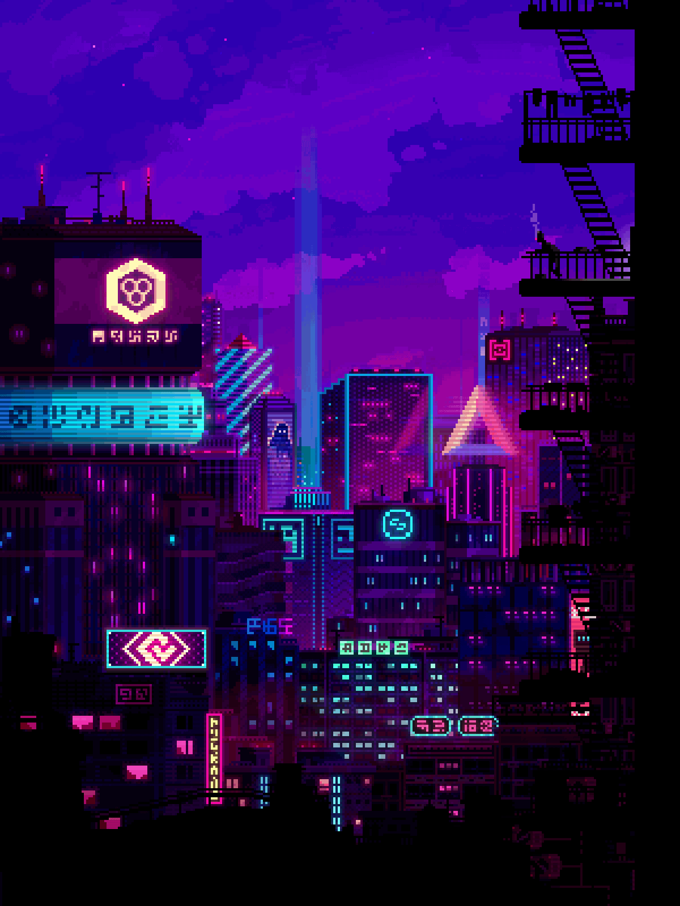

# Bansimplified

<!--## 💫 About Me:-->

 
 

<h2 align="center">

Full-Stack Developer • Frontend-Enthusiast

</h2>

 

### 👨‍💻 About Me
- I’m **Jade Ivan (Bansimplified)** — an IT (Programming) student from the Philippines.
- Actively enhancing my software engineering foundation across **frontend, backend, and full-stack workflows**.
- Passionate about building scalable web systems, UI engineering, and modern development tooling.
- **Decade Goal:** Become a full-fledged Software Engineer.
- Interests include: Coffee, learning new frameworks, and creative coding.
- Hobbies: Reading manga/manhwa, drawing, and exploring digital storytelling.

📄 **Resume:**
[Download Resume](./src/components/Pages/About/Bringcolajadeivan,V.pdf)

<h2></h2>

  <h2> <strong> 📚 Education and Connection </strong>
    
   </h2>
   
  
  
  
  
  
  

   

  <h2> <strong> ⚙️ Technologies and Skills </strong></h2>

| Category              | Skills |
|-----------------------|--------|
| **Frontend**          |  |
| **Backend & Tools**   |  |
| **Dev Tools & Others**|  |
| **Operating Systems** |  |

 

  <h2> 🏆 My Github Stats </h2>
  <table>
    <tr>
      <td width="49%" colspan="1">
        
         
      </td>
    </tr>
    <tr>
      <td colspan="2">
        
      </td>
    </tr>
  </table>

<h2 align="center">

👨‍💻 Projects
</h2>

  

    

      
    

  

  

<!--END_SECTION:activity-->
<!--
## Tech Stacks
- FrontEnd Developer (Aspiring FrontEnd Developer).
- UX/UI.
- MERN Stack.
- HTML, CSS , JAVASCRIPT , REACT , NODE.JS , TYPESCRIPT , PHP , C++ , PYTHON , GIT , GITHUB , VSCODE , POWER SHELL , XAMPP , WINDOWS , LINUX , UBUNTU , DEBIAN.
-->

<!-- Proudly created with GPRM ( https://gprm.itsvg.in ) -->
