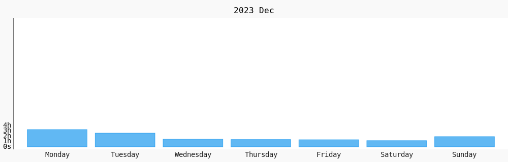

# BanSimplified

  

  <h2>
    
    Full-Stack Developer • Frontend Enthusiast
    
  </h2>

### 👨‍💻 About Me

- I'm **Jade Ivan (BanSimplified)** — an IT (Programming) student from the Philippines.
- Actively enhancing my software engineering foundation across **frontend, backend, and full-stack workflows**.
- Passionate about building scalable web systems, UI engineering, and modern development tooling.
- **Decade Goal:** Become a full-fledged Software Engineer.
- Interests include: Coffee, learning new frameworks, and creative coding.
- Hobbies: Reading manga/manhwa, drawing, and exploring digital storytelling.

📄 **Resume:** [Download Resume](https://raw.githubusercontent.com/BanSimplified567/BanSimplified567/main/src/components/Pages/About/Bringcolajadeivan,V.pdf)

  <h2>
   
    <strong>📚 Education and Connections</strong>
    
  </h2>
   
  
  
  
  
  
  

 

 

  <h2>
   
    <strong>⚙️ Technologies and Skills</strong>
     
  </h2>

   

  | Category              | Skills                                                                 |
  |-----------------------|------------------------------------------------------------------------|
  | **Frontend**          |  |
  | **Backend & Tools**   |  |
  | **Dev Tools & Others**|  |
  | **Operating Systems** |  |

   

  <h2>🏆 My GitHub Stats</h2>
  
  
   
    
  

<!-- Proudly created with GPRM (https://gprm.itsvg.in) -->
